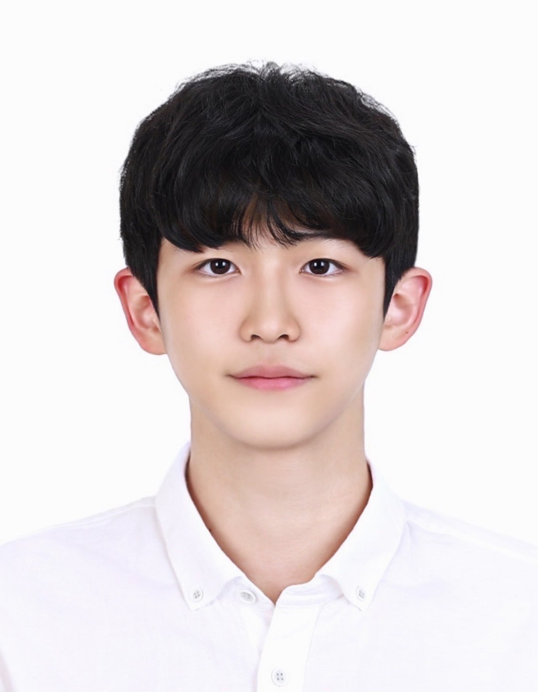
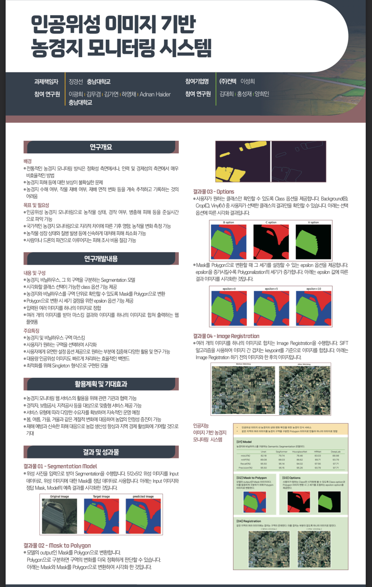

  김무겸 포트폴리오  

김무겸 (Kim MuGyum)
================

Deep Learning Researcher

&

Aspiring Full-Stack Developer

[Instagram](https://www.instagram.com/nonenonenonenonnn) [Tistory](https://small0753.tistory.com) [Email](mailto:small0753@daum.net) [LinkedIn](https://www.linkedin.com/in/nonenonenonennn/)

About Me
--------

저는 현재 **충남대학교 인공지능학과**에 휴학 중이며, **공군 군악대**에서 복무 중입니다.

아래의 가치를 중심으로 생각합니다.

*   **긍정적인 사회적 영향**을 주는 AI 활용
*   **사용자 중심 문제 해결** 지향
*   **효과적인 협업**과 **커뮤니케이션** 중시
*   **AI 기반 웹·앱 서비스 개발**에 높은 관심
*   **사용자 친화적 UI/UX 설계** 최우선

### 관심 분야

*   **컴퓨터 비전 (CV)**
*   **AI 기반 웹·앱 서비스 개발**
*   **사용자 친화적 UI/UX 설계**

### 목표

*   **실질적으로 도움이 되는 AI 서비스 구현**
*   **현실 문제를 해결하는 기술 개발**
*   **사용자의 입장에서 설계된 서비스 제공**

Skills
------

### 💻 Languages

*   
*   
*   
*   

### 🛠️ Frameworks & Tools

*   
*   
*   

Projects
--------

### 🌍 Satellite Image Segmentation

**인공지능 기반 이미지 세그멘테이션**을 통해 위성 이미지 상의 **경작지 면적을 자동으로 분석**하고, 이를 기반으로 **기업에게 B2C AI 서비스를 제공**하는 프로젝트입니다.

*   **분야:** 위성 이미지 분석 · 스마트 농업
*   **기술:** Deep Learning, Segmentation, Computer Vision

[🔗 GitHub Link](https://github.com/kmmugyum/Satellite_Image_Segmentation)

Contact
-------

이메일 [small0753@daum.net](mailto:small0753@daum.net)

GitHub [github.com/kmmugyum](https://github.com/kmmugyum)

블로그 [small0753.tistory.com](https://small0753.tistory.com)

Instagram [@nonenonenonenonnn](https://www.instagram.com/nonenonenonenonnn)

LinkedIn [linkedin.com/in/nonenonenonennn](https://www.linkedin.com/in/nonenonenonennn/)

전화번호 010-7938-1804

© 2025 김무겸. All rights reserved.
